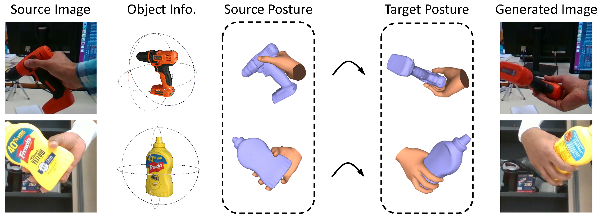

# Hand-Object Interaction Image Generation



> [**Hand-Object Interaction Image Generation**](https://arxiv.org/abs/2211.15663)<br>
> [Hezhen Hu](https://dblp.org/pid/273/3660.html), [Weilun Wang](https://scholar.google.com/citations?hl=zh-CN&user=YfV4aCQAAAAJ), [Wengang Zhou](https://scholar.google.com/citations?hl=zh-CN&user=8s1JF8YAAAAJ), [Houqiang Li](https://scholar.google.com/citations?hl=zh-CN&user=7sFMIKoAAAAJ)<br>University of Science and Technology of China

## Overview


We provide our PyTorch implementation of Hand-Object Interaction Image Generation.
In this work, we are dedicated to a new task, i.e., hand-object interaction image generation, which aims to conditionally generate the hand-object image under the given hand, object and their interaction status.
This task is challenging and research-worthy in many potential application scenarios, such as AR/VR games and online shopping, etc.
To address this problem, we propose a novel HOGAN framework, which utilizes the expressive model-aware hand-object representation and leverages its inherent topology to build the unified surface space.
Extensive experiments on two large-scale datasets, i.e., HO3Dv3 and DexYCB, demonstrate the effectiveness and superiority of our framework both quantitatively and qualitatively.


## Example Results
* **HO3Dv3:**


* **DexYCB:**


## Prerequisites
- Linux
- Python 3
- CPU or NVIDIA GPU + CUDA CuDNN

### Getting started

- Install PyTorch and other dependencies (e.g., torchvision, visdom, dominate, gputil).

  For pip users, please type the command `pip install -r requirements.txt`.

- Install Third-party dependencies in the `thirdparty` dir.

### HOGAN Training and Test

- Download the `HO3Dv3` dataset.

- To view training results and loss plots, run `python -m visdom.server` and click the URL http://localhost:8097.

- Train the HOGAN model:
```bash
bash scripts/train_hov3_ddp.sh
```
The checkpoints will be stored at `./checkpoints/`.

- Test the HOGAN model:
```bash
bash scripts/eval_hov3.sh
```

The test results will be stored at `./results`.


### Citation
If you find Hand-Object Interaction Image Generation useful for your work please cite:
```
@inproceedings{hu2022hand,
  author    = {Hu, Hezhen and Wang, Weilun and Zhou, Wengang and Li, Houqiang},
  title     = {Hand-Object Interaction Image Generation},
  booktitle = {NeurIPS},
  year      = {2022},
}
```

### Acknowledge
We thank [pytorch-fid](https://github.com/mseitzer/pytorch-fid.git) for FID computation, [PerceptualSimilarity](https://github.com/richzhang/PerceptualSimilarity.git) for LPIPS computation.

